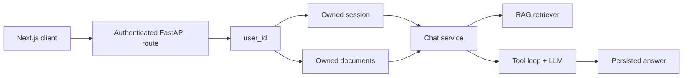

# Engineering AI Assistant Backend

A FastAPI assistant that combines retrieval-augmented generation (RAG),
structured JSON output, and external tool calling. It can use hosted models
through Hugging Face or an OpenAI-compatible model served with vLLM.

## Features

- Asynchronous FastAPI endpoints and external API clients
- Hugging Face primary and fallback models
- Optional local or remote vLLM backend
- JSON Schema-constrained assistant responses
- Bounded agent loop with adaptive cross-source verification
- Tool calling with calculator, UTC time, weather, and Monid discovery tools
- Markdown, text, and PDF ingestion
- Local sentence-transformer embeddings and Qdrant vector search
- Verifiable document citations in chat responses
- Redis-backed per-user chat rate limiting
- Automatic removal of expired PostgreSQL documents and Qdrant vectors
- Docker image and optional GPU vLLM Compose profile

The detailed system diagram is in [Architecture](docs/architecture.md).

## Request flow



The authenticated `user_id` is passed into session, chat, and document use
cases. It is the ownership boundary for PostgreSQL records and Qdrant points;
clients cannot select another user's sessions or documents by changing an ID.

## Project structure

```text
app/
├── api/          # HTTP routes and dependencies
├── assistant/    # Prompt construction and agent/tool loop
├── core/         # Typed settings and logging
├── llm/          # Hugging Face and vLLM-compatible client
├── rag/          # Loading, chunking, embeddings, retrieval, and Qdrant
├── schemas/      # Validated request, response, and domain models
├── services/     # Chat and ingestion use cases
└── tools/        # Tool registry and individual tool implementations
data/documents/   # Example knowledge-base documents
notebooks/        # Colab vLLM deployment
scripts/          # Command-line document ingestion
```

## Requirements

- Python 3.12
- [uv](https://docs.astral.sh/uv/) for locked dependency management
- PostgreSQL 15 or newer
- A Hugging Face access token, or a running vLLM endpoint
- A Qdrant Cloud cluster
- An ngrok account only when exposing vLLM from Colab

vLLM itself requires a compatible GPU for this project. It is intentionally
optional and is not started by the normal Docker Compose command.

## Local setup

From this directory, create the environment file:

```bash
cp .env.example .env
```

On Windows PowerShell:

```powershell
Copy-Item .env.example .env
```

Fill in `DATABASE_URL`, `HF_TOKEN`, `QDRANT_URL`, and `QDRANT_API_KEY`. Keep
`.env` private. Then reproduce the locked environment and apply migrations:

```bash
uv sync --locked
uv run alembic upgrade head
uv run uvicorn app.main:app --reload
```

Open the API documentation at <http://localhost:8000/api/docs> and check health at
<http://localhost:8000/api/v1/health>.

To run PostgreSQL through Docker while developing locally:

```bash
docker compose up -d db redis
alembic upgrade head
```

Alembic owns database schema changes. Do not create application tables with
`Base.metadata.create_all()`.

## Ingest a document

Protected endpoints use the HttpOnly session cookie created by
`POST /api/v1/auth/google`. The frontend should include credentials on every
request. The examples below assume that cookie has already been saved to
`cookies.txt`.

Upload a document through the API:

```bash
curl -X POST http://localhost:8000/api/v1/documents \
  -H "accept: application/json" \
  -b cookies.txt \
  -F "file=@data/documents/nepal_flood.md;type=text/markdown"
```

The response contains the document UUID needed when sending a chat message.
Administrators can also ingest a file for a known user directly:

```bash
python scripts/ingest_documents.py \
  data/documents/nepal_flood.md \
  --user-id USER_UUID
```

The ingestion pipeline receives the target `user_id`, validates the file,
extracts text, creates overlapping chunks, and stores both PostgreSQL metadata
and user-scoped Qdrant points. Qdrant Cloud inference performs hybrid retrieval
and reranking when available; local dense embeddings are the fallback.

Expired documents are removed from both PostgreSQL and Qdrant. The background
cleanup worker runs at startup and at the configured interval; the same bounded
operation can be run manually with the cleanup script.

## Ask a question

```bash
curl -X POST http://localhost:8000/api/v1/chat \
  -H "Content-Type: application/json" \
  -b cookies.txt \
  -d '{
    "session_id": "SESSION_UUID",
    "message": "What caused the Nepal floods? Cite the report.",
    "document_ids": ["DOCUMENT_UUID"]
  }'
```

Chat history is loaded from PostgreSQL rather than accepted from the client.
Before retrieval, the chat service verifies that requested documents belong to
the authenticated user and are attached to the user's session. The retriever
receives only those validated document IDs and cannot access another user's
documents. The response reports citations, executed tools, agent trajectory,
token usage, selected model, fallback status, and pipeline statistics.

The agent can perform several bounded tool-planning rounds. A failed tool call
is returned as a tool result so the model can retry or choose another tool. The
final streamed answer is generated in a separate tool-free request, followed by
a structured metadata request.

## Streaming chat

`POST /api/v1/chat/stream` returns Server-Sent Events. Events are emitted in
this order as work becomes available:

| Event | Purpose |
| --- | --- |
| `status` | Retrieval or generation progress |
| `tool` | Completed tool result, including failures |
| `delta` | Incremental final answer text |
| `complete` | Validated answer, citations, tools, agent trajectory, tokens, model, and statistics |
| `error` | Request, retrieval, or model failure |

The backend persists a pending assistant message before generation. On normal
completion it saves the final response. On cancellation it saves received text
with status `stopped`; on failure it saves received text with status `error`.
The final `complete` event is emitted only after answer metadata passes schema
validation.

## Clean up expired documents

The API checks for expired documents when it starts and then at the configured
interval. Run the same bounded cleanup manually with:

```bash
python -m scripts.cleanup_documents
```

Set `DOCUMENT_CLEANUP_INTERVAL_SECONDS=0` to disable the background worker.

## LLM backends

### Hugging Face

```env
LLM_BACKEND=huggingface
HF_MODEL=openai/gpt-oss-20b:groq
HF_FALLBACK_MODEL=deepseek-ai/DeepSeek-V4-Flash-0731:deepinfra
```

If the primary provider has an API, connection, timeout, rate-limit, or server
failure before streamed content is received, the client retries through the
configured fallback model. Partial output is never combined across models.

### vLLM on Colab

Open [the Colab notebook](notebooks/vllm_colab.ipynb), select a GPU runtime,
and add `NGROK_AUTHTOKEN` and `VLLM_API_KEY` to Colab Secrets. The notebook
starts the quantized `Qwen/Qwen2.5-14B-Instruct-AWQ` model and prints a protected
ngrok URL.

Configure the local backend using that URL and the same API key:

```env
LLM_BACKEND=vllm
VLLM_BASE_URL=https://your-ngrok-domain.ngrok-free.app/v1
VLLM_API_KEY=your-private-key
VLLM_MODEL=Qwen/Qwen2.5-14B-Instruct-AWQ
```

Restart FastAPI after changing `.env`. Stop the Colab runtime after testing;
the ngrok URL is temporary and publicly reachable, although model routes are
protected by the vLLM API key.

## Docker

Run only the API with the configured hosted backend:

```bash
docker compose up --build api
```

On a Linux machine with an NVIDIA GPU and NVIDIA Container Toolkit, run the API
and optional vLLM service:

```bash
docker compose --profile local up --build
```

Set `LLM_BACKEND=vllm` before using the local profile. The API reaches vLLM at
`http://vllm:8000/v1` inside the Compose network.

## Quality checks

```bash
uv run ruff format --check .
uv run ruff check .
uv run mypy app scripts tests
uv run pytest
```

## Week 16 agentic extension

### Agentic feature

The new feature is **adaptive cross-source verification**. When a user asks to
verify, research, or compare a claim, the model examines each observation and
chooses whether to use another source, switch tools, ask a focused clarification
question, or answer with an explicit limitation. A fixed pipeline is
insufficient because each source may confirm, contradict, or leave gaps in the
current evidence, so the next search and stopping decision must depend on what
the agent discovers at runtime.

The loop is bounded by `LLM_MAX_TOOL_ITERATIONS` (five by default). Only one
external evidence call is requested per turn, ensuring that the next action can
depend on the previous result. Successful and failed tool observations are both
returned to the model; a failed call is marked as missing evidence and never as
support for a claim.

### Context Engineering Technique

The loop uses **structured, capped external notes**. After a tool executes,
`AssistantAgent` keeps the complete result for the API response and UI, but
returns a JSON observation containing the tool name, validated arguments,
success state, bounded evidence, and a truncation flag to the model. The cap is
configured with `LLM_TOOL_RESULT_MAX_CHARACTERS`. This is applied after every
tool step because discovery and research APIs can return large payloads that
would otherwise repeatedly consume the context window and hide the evidence
needed for the next decision. Document retrieval separately caps and reranks
candidates before adding them to the prompt.

### Agentic Pattern

This implementation uses a **single-agent loop**. Verification actions are
sequentially dependent: the agent must inspect one observation before deciding
whether a second source is useful. A multi-agent design would add coordination
tokens without useful parallelization or context isolation for this scope. The
bounded context notes address context saturation, while provider fallback
reduces the single-point-of-failure risk.

### Evaluation Harness

The harness in `scripts/evaluate_agent.py` calls the real configured LLM while
using a deterministic evidence tool. Its cases cover corroborating sources,
conflicting sources, an ambiguous request that should trigger clarification,
and an intentionally unavailable source. It measures task completion,
tool-name and argument correctness, trajectory length, and prompt/completion/
total tokens for every query. Failures are classified as hard, soft, or
cascading soft failures.

Run it from the backend directory:

```bash
python -m scripts.evaluate_agent
```

The latest measured report is in [Agent evaluation results](evals/results.md).
The recorded run completed 4/4 cases, selected valid tools and source arguments
in 4/4 cases, averaged 2.75 iterations, and consumed 14,523 tokens. Monetary
cost is not estimated because the selected Hugging Face provider routes do not
return a stable price with each response.

### Skill vs. Agent

A Skill could describe verification rules, but it could not observe changing
tool results and decide whether to search again, clarify, or stop; therefore
this capability belongs in the agent loop.

### Failure Injection

The `injected_tool_failure` case makes `unavailable_source` raise a controlled
timeout-style error. The registry converts it into a failed observation. In the
recorded run, the agent recognized the failure, consulted two available sources,
and completed in four iterations without treating the failed source as evidence.

### Tool vs. Agent Boundary

Monid is modeled as three bounded tools (`discover`, `inspect`, and `run`), not
as another agent. The main agent owns the goal, chooses each next action, and
interprets results; Monid only performs one deterministic external API operation
per call. Treating it as agent-to-agent communication would add unclear autonomy
and coordination overhead without gaining specialization.

## Week 17 MLOps extension

### Reproducible environment

`pyproject.toml` declares runtime and development dependencies, while `uv.lock`
pins the complete Python 3.12 environment. Use `uv sync --locked`; do not update
the lock file merely to run an experiment.

### Prompt experiments and traces

Three prompts are stored as immutable files under
`app/assistant/prompt_versions/`. `prompt_v1` is the simple baseline. `prompt_v2`
adds independent-source verification, conflict handling, and failed-tool rules
after the baseline stopped too early or exhausted its loop. `prompt_v3` adds
adaptive stopping, focused clarification, and explicit recovery to reduce rigid
two-source behavior.

Run the same four cases against every version:

```bash
uv run python -m scripts.run_prompt_experiments
uv run mlflow server --backend-store-uri sqlite:///mlflow.db --port 5000
```

Each MLflow run stores configuration, prompt hash, aggregate quality/cost
metrics, and complete JSON traces. A trace records each tool name, validated
arguments, raw result, observable decision summary, iteration, token usage, and
termination reason. Representative traces and failure diagnoses are committed
under [`evals/mlops/runs`](evals/mlops/runs).

| Version | Completion | Tool correctness | Avg iterations | Avg tokens | Total tokens |
| --- | ---: | ---: | ---: | ---: | ---: |
| `prompt_v1` | 0% | 50% | 2.25 | 1,768 | 7,070 |
| `prompt_v2` | 75% | 100% | 2.75 | 2,890 | 11,560 |
| `prompt_v3` | 75% | 75% | 2.50 | 3,024 | 12,097 |

`prompt_v2` is the experiment winner: it matches v3's completion rate, has the
best tool correctness, and uses fewer tokens. v3 is not promoted because its
extra instructions cost more while one confirmed-claim run stopped after only
one source. The baseline also reached the iteration cap during injected failure
recovery. These measured failures, rather than preference alone, drove each
prompt change. Provider routes do not expose stable per-request prices, so token
usage is the cost proxy.

### Evidently LLM regression suite

The fixed golden set in [`golden_responses.json`](evals/mlops/golden_responses.json)
contains the same four questions and approved reference responses. The current
dataset is built from the saved candidates for all three prompt versions. An
Evidently LLM judge performs two binary checks per response:

1. reference-based correctness;
2. relevance to the question, including a necessary focused clarification.

Run it after the prompt experiment:

```bash
uv run python -m scripts.run_agent_regression
```

| Version | Judge checks passed | Promotion decision |
| --- | ---: | --- |
| `prompt_v1` | 62% | Block |
| `prompt_v2` | 88% | Pass |
| `prompt_v3` | 88% | Pass |

The 75% threshold is logged to each existing MLflow run as
`pct_tests_passed`. The main remaining regression is overconfident wording after
an injected source failure: v2 and v3 omit the unavailable-source limitation and
state gradual reopening too absolutely. The full verdicts, judge explanations,
HTML report, and JSON report are in
[`evals/mlops/regression`](evals/mlops/regression). LLM-judge output is treated
as a review signal, not unquestionable ground truth; the committed verdict table
keeps the candidate, reference, and reasoning together for human inspection.

### Scope and limitations

- The suite has four controlled cases, so it is a regression gate rather than a
  broad benchmark.
- Token counts compare provider usage, but monetary cost is unavailable.
- External provider behavior can change even with a locked local environment.
- Airflow orchestration is optional in the assignment and is not included; both
  bounded evaluation stages are explicit CLI jobs suitable for CI or a future
  scheduler.

## API endpoints

| Method | Endpoint | Purpose |
| --- | --- | --- |
| `GET` | `/api/v1/health` | Application liveness check |
| `POST` | `/api/v1/auth/google` | Sign in with a Google ID credential |
| `GET` | `/api/v1/auth/me` | Return the authenticated user |
| `POST` | `/api/v1/auth/logout` | Revoke the current application session |
| `GET, POST` | `/api/v1/sessions` | List or create chat sessions |
| `GET, PATCH, DELETE` | `/api/v1/sessions/{id}` | Read, rename, or delete an owned session |
| `POST` | `/api/v1/documents` | Ingest one owned `.md`, `.txt`, or `.pdf` file |
| `POST` | `/api/v1/documents/batch` | Ingest multiple owned files |
| `POST` | `/api/v1/chat` | Run retrieval, tools, and structured generation |
| `POST` | `/api/v1/chat/stream` | Stream progress, tool calls, and answer events |

## ONNX decision

ONNX conversion is not used for the generative model. vLLM performs optimized
GPU inference using continuous batching, paged attention, and its supported
quantized model formats; converting that model to ONNX would bypass the serving
features this project is intended to demonstrate. The compact embedding model
runs locally on CPU, where ONNX could be evaluated later if profiling shows
embedding latency is a bottleneck.
