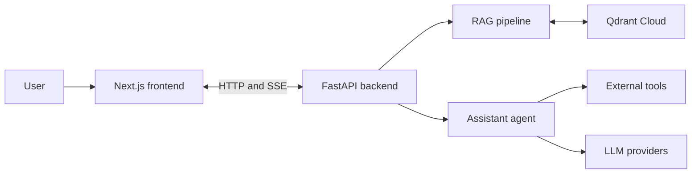
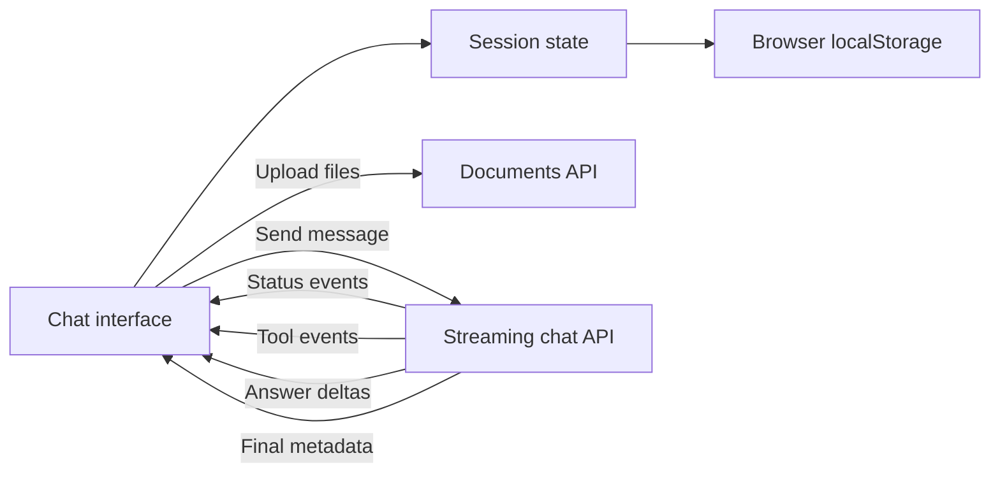
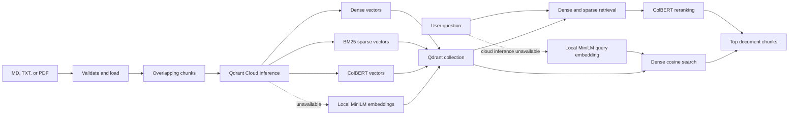
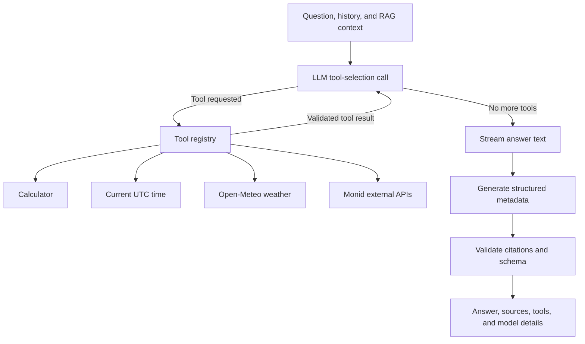
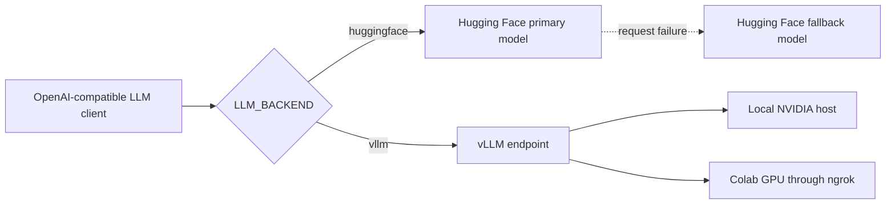
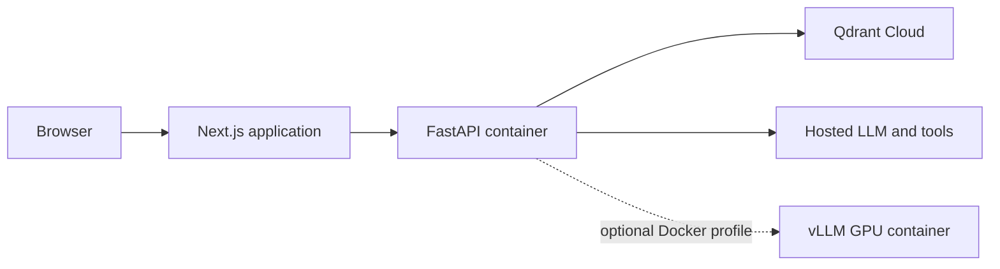

# Architecture

The AI assistant has two applications: a Next.js frontend and a FastAPI
backend. The frontend handles the user experience and local chat sessions. The
backend owns RAG, tool execution, model access, and document ingestion.

## Overall system

## Frontend and API

The frontend aborts the active streaming request when the user presses the stop
button. Any answer text already received remains in the session.

## Document ingestion and retrieval

Single-file and batch upload endpoints use the same ingestion pipeline. Batch
uploads have bounded concurrency, and every file receives its own result.

## Assistant agent

Tool selection and structured output use separate model calls because some
OpenAI-compatible providers do not allow tool calling and JSON mode together.
The loop is bounded by `LLM_MAX_TOOL_ITERATIONS`.

## Model routing

The backend may use the fallback model only before streamed output begins. It
does not combine a partial response from one model with output from another.

## Deployment

The default Docker Compose command starts only FastAPI. vLLM is in the optional
`local` profile so it cannot start accidentally on a development laptop.
