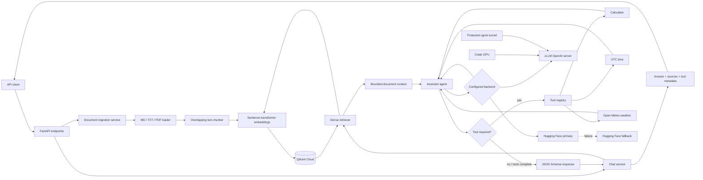

# Architecture

## Request flow

1. The chat service embeds the question and retrieves relevant chunks from
   Qdrant when RAG is enabled.
2. Retrieved text is placed inside explicit context boundaries in the system
   prompt.
3. The agent asks the configured model whether a tool is required.
4. Requested tools are validated, executed, and returned to the same model.
5. Tool selection and structured generation use separate model calls because
   some OpenAI-compatible providers reject JSON mode combined with tools.
6. The final response is validated against `AssistantOutput` and invented chunk
   IDs are removed before citations reach the client.

## Deployment views

The default development and Docker path uses Hugging Face inference with
Qdrant Cloud. The GPU path runs vLLM either from the optional Compose profile on
an NVIDIA host or from Google Colab through a protected ngrok tunnel. Both
backends expose the same OpenAI-compatible interface, so the application code
switches through environment configuration rather than backend-specific routes.
