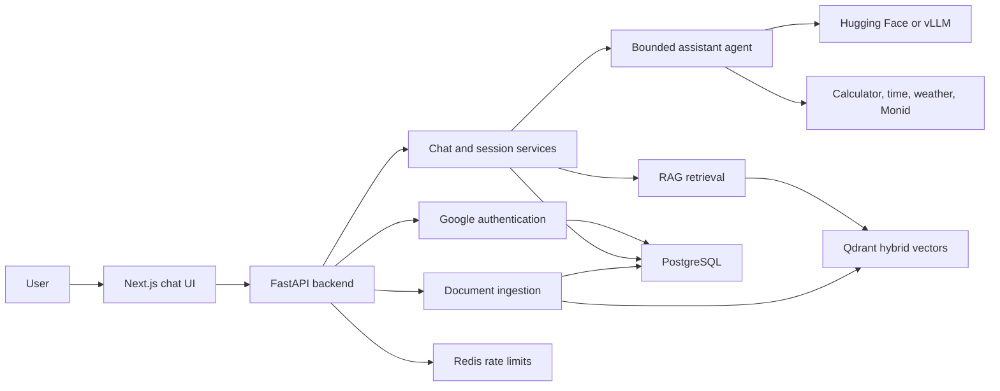
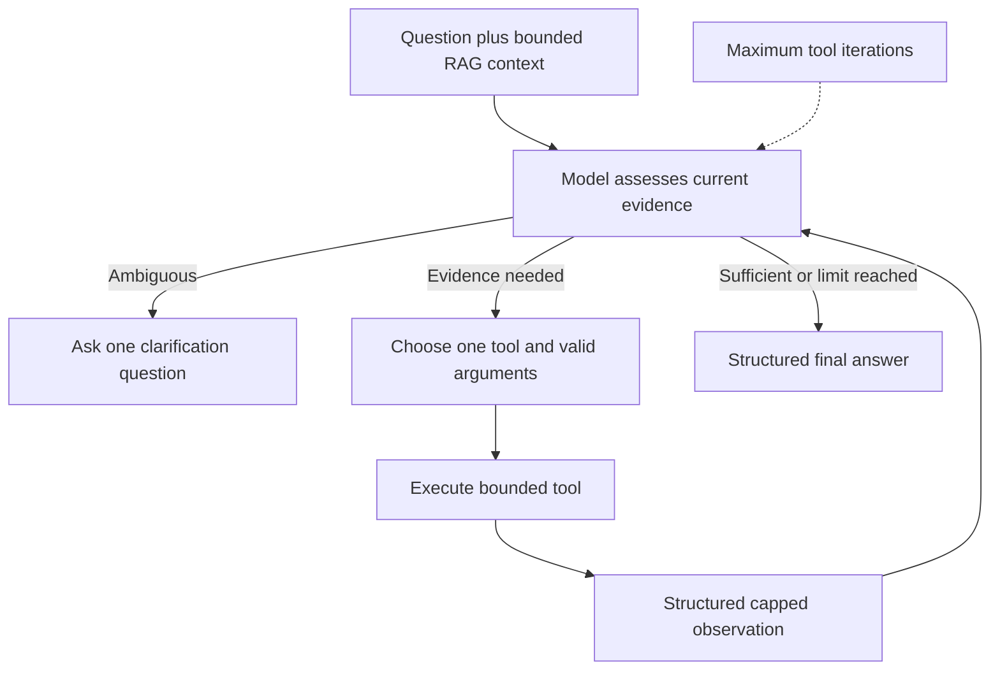
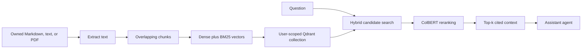
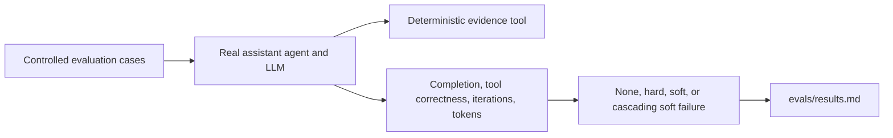

# System Architecture

## Overall system

```mermaid
flowchart LR
  User["User"] --> Web["Next.js chat UI"]
  Web --> API["FastAPI backend"]
  API --> Auth["Google authentication"]
  API --> Chat["Chat and session services"]
  API --> Ingest["Document ingestion"]
  Chat --> Agent["Bounded assistant agent"]
  Chat --> RAG["RAG retrieval"]
  Agent --> LLM["Hugging Face or vLLM"]
  Agent --> Tools["Calculator, time, weather, Monid"]
  RAG --> Qdrant["Qdrant hybrid vectors"]
  Auth --> Postgres["PostgreSQL"]
  Chat --> Postgres
  Ingest --> Postgres
  Ingest --> Qdrant
  API --> Redis["Redis rate limits"]
```

PostgreSQL stores users, sessions, messages, document metadata, and attachment
relationships. Qdrant stores user-scoped document chunks. The backend validates
ownership before retrieval, and the browser communicates through authenticated
HTTP and Server-Sent Events.

## Agentic verification loop

```mermaid
flowchart TD
  Q["Question plus bounded RAG context"] --> Decide["Model assesses current evidence"]
  Decide -->|"Ambiguous"| Clarify["Ask one clarification question"]
  Decide -->|"Evidence needed"| Call["Choose one tool and valid arguments"]
  Call --> Execute["Execute bounded tool"]
  Execute --> Note["Structured capped observation"]
  Note --> Decide
  Decide -->|"Sufficient or limit reached"| Answer["Structured final answer"]
  Limit["Maximum tool iterations"] -.-> Decide
```

The model controls which tool to use and whether another iteration is useful.
The application controls safety: registered schemas validate arguments, external
writes are not exposed, observations are capped, and the maximum iteration count
prevents an infinite loop. Full tool results remain available in the API response
even though the model receives the bounded note.

## Retrieval and ingestion

```mermaid
flowchart LR
  Upload["Owned Markdown, text, or PDF"] --> Load["Extract text"]
  Load --> Chunk["Overlapping chunks"]
  Chunk --> Index["Dense plus BM25 vectors"]
  Index --> Qdrant["User-scoped Qdrant collection"]
  Question["Question"] --> Search["Hybrid candidate search"]
  Search --> Rerank["ColBERT reranking"]
  Rerank --> Context["Top-k cited context"]
  Qdrant --> Search
  Context --> Agent["Assistant agent"]
```

When Qdrant Cloud inference is unavailable, retrieval falls back to local dense
embeddings and cosine search. Expired documents are deleted from PostgreSQL and
Qdrant by the cleanup service.

## Evaluation path

```mermaid
flowchart LR
  Cases["Controlled evaluation cases"] --> Agent["Real assistant agent and LLM"]
  Agent --> Fixture["Deterministic evidence tool"]
  Agent --> Metrics["Completion, tool correctness, iterations, tokens"]
  Metrics --> Taxonomy["None, hard, soft, or cascading soft failure"]
  Taxonomy --> Report["evals/results.md"]
```

The controlled evidence tool makes trajectories repeatable while still testing
the actual model-driven planning loop. One source deliberately fails so recovery
behavior is measured rather than assumed.
