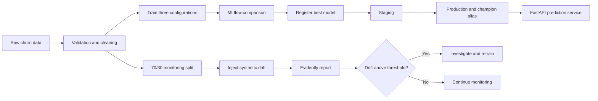

# Track A: Telco Customer Churn MLOps

This project applies a complete MLOps workflow to the IBM Telco Customer Churn
dataset: reproducible setup, experiment tracking, model registration, serving,
and drift monitoring.

## Workflow



## Project structure

```text
track-a-telco-churn/
|-- artifacts/
|   |-- figures/             # Confusion matrices and ROC curves
|   `-- reports/             # Comparison, registry, and Evidently reports
|-- data/
|   |-- raw/                 # Prepared data, ignored by Git
|   `-- processed/           # Monitoring splits, ignored by Git
|-- src/telco_churn/
|   |-- api.py               # FastAPI model service
|   |-- config.py            # Shared paths and MLflow settings
|   |-- data.py              # Dataset validation and preparation
|   |-- dataset.py           # Cleaning and stratified splitting
|   |-- modeling.py          # Preprocessing and model definitions
|   |-- monitoring.py        # Evidently drift workflow
|   `-- training.py          # MLflow experiments and registration
|-- tests/
|-- pyproject.toml
`-- uv.lock
```

## Environment and reproducibility (`uv`)

The project previously depended on whichever package versions happened to be
installed in the active Python environment. This is risky because MLflow,
Evidently, pandas, and scikit-learn change their APIs independently. `uv.lock`
records the resolved versions for all direct and transitive dependencies, while
`pyproject.toml` records the supported dependency ranges and Python version.

From a clean clone at the repository root:

```bash
cd week17-mlops/track-a-telco-churn
uv sync --locked
uv run prepare-data
uv run pytest
```

`prepare-data` validates and copies the dataset from the repository's existing
`week4-linear-models/WA_Fn-UseC_-Telco-Customer-Churn.csv`. A different local
copy can be provided with:

```bash
uv run prepare-data --source /path/to/WA_Fn-UseC_-Telco-Customer-Churn.csv
```

The raw dataset contains 7,043 customers. Eleven blank `TotalCharges` values
are converted to missing numeric values and imputed inside the model pipeline,
which prevents data leakage.

## Experiment tracking strategy (`MLflow`)

Run the experiments:

```bash
uv run train-models
```

Open the local MLflow interface:

```bash
uv run mlflow server --backend-store-uri sqlite:///mlflow.db --port 5000
```

Then visit <http://localhost:5000>. Every run records its model parameters,
fixed split configuration, accuracy, precision, recall, F1, ROC-AUC, fitted
pipeline, confusion matrix, and ROC curve.

### Run comparison

All configurations use the same stratified 80/20 split and random seed.

| Model | Accuracy | Precision | Recall | F1 | ROC-AUC |
|---|---:|---:|---:|---:|---:|
| Random forest, depth 10, 250 trees | 0.7544 | 0.5256 | 0.7674 | **0.6239** | 0.8394 |
| Logistic regression, C=1.5 | 0.7395 | 0.5061 | 0.7807 | 0.6141 | 0.8412 |
| Logistic regression, C=0.5 | 0.7374 | 0.5034 | **0.7834** | 0.6130 | **0.8415** |

The random forest was selected because it achieved the highest F1 score
(`0.6239`). F1 is the primary selection metric because only 26.5% of customers
churn, so accuracy alone would reward the majority class. Logistic regression
had marginally higher recall and ROC-AUC, but its lower precision reduced its
F1 score. The selected model therefore offers the best balance between finding
churners and limiting false alerts.

The winning pipeline was registered as `telco-churn-classifier`, transitioned
through **Staging** and **Production**, and assigned the `champion` alias.
MLflow has deprecated stages in favor of aliases, so this project records the
required stage transitions while using `champion` for serving.

Generated evidence:

- [`model_comparison.csv`](artifacts/reports/model_comparison.csv)
- [`best_model.json`](artifacts/reports/best_model.json)
- [`registered_model.json`](artifacts/reports/registered_model.json)
- [`artifacts/figures`](artifacts/figures)

## Model serving

The API loads `models:/telco-churn-classifier@champion` from the registry:

```bash
uv run serve-model
```

Open <http://localhost:8000/docs>, or send a request directly:

```bash
curl -X POST http://localhost:8000/predict \
  -H "Content-Type: application/json" \
  -d '{
    "gender": "Female",
    "SeniorCitizen": 0,
    "Partner": "Yes",
    "Dependents": "No",
    "tenure": 1,
    "PhoneService": "No",
    "MultipleLines": "No phone service",
    "InternetService": "DSL",
    "OnlineSecurity": "No",
    "OnlineBackup": "Yes",
    "DeviceProtection": "No",
    "TechSupport": "No",
    "StreamingTV": "No",
    "StreamingMovies": "No",
    "Contract": "Month-to-month",
    "PaperlessBilling": "Yes",
    "PaymentMethod": "Electronic check",
    "MonthlyCharges": 29.85,
    "TotalCharges": 29.85
  }'
```

## Monitoring and drift strategy (`Evidently`)

Run monitoring with:

```bash
uv run monitor-drift
```

The **reference** dataset is a reproducible 70% sample representing training-
time behavior. The **current** dataset is the remaining 30%, representing new
production traffic. The monitoring command intentionally changes the current
data so detection can be verified:

- Adds 20 to `MonthlyCharges`, capped at 150.
- Changes 90% of current contracts to `Month-to-month`.
- Changes the current churn rate to approximately 55%.

### Monitoring results

| Signal | Reference | Current | Evidently drift score |
|---|---:|---:|---:|
| Mean MonthlyCharges | 64.95 | 84.32 | **0.6406** |
| Month-to-month share | 54.8% | 95.9% | **0.3590** |
| Churn rate | 26.5% | 55.0% | **0.2065** |

All three scores exceed the configured `0.10` threshold. Evidently's custom
`MeanValue` tests also require the current `MonthlyCharges` mean to remain
within 15% of the reference mean; the upper-bound test fails as expected.

In production, this result should stop automatic model promotion and create an
investigation alert. The team should first confirm whether the shift is a data
quality problem or a genuine customer change. Genuine sustained drift should
trigger retraining, offline validation against the current production cohort,
and registration of a new model version only if it improves the agreed F1 and
ROC-AUC thresholds.

Generated evidence:

- [`data_and_target_drift.html`](artifacts/reports/drift/data_and_target_drift.html)
- [`data_and_target_drift.json`](artifacts/reports/drift/data_and_target_drift.json)
- [`summary.md`](artifacts/reports/drift/summary.md)

The same HTML, JSON, summary, parameters, and metrics are logged as artifacts
under the `telco-churn-drift-monitoring` MLflow experiment.

## Quality checks

```bash
uv run ruff check src tests
uv run mypy src tests
uv run pytest
```

The current test suite covers data validation, type conversion, stratified
splitting, metric calculation, model selection, API validation, and deterministic
drift injection.

## Optional orchestration

Airflow is an optional bonus and is not included. A production DAG would run
the monitoring command on a schedule, evaluate the drift thresholds, and start
a retraining and approval workflow when sustained drift is confirmed.

